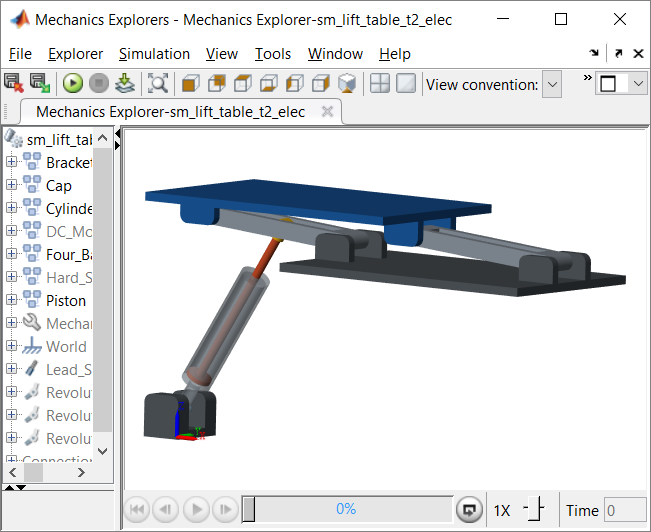

# **Simscape Multibody Multiphysics Library**
Copyright 2013-2023 The MathWorks(TM), Inc.
test edit
This repository contains example models showing how to extend Simscape Multibody models
by adding physical effects spanning multiple physical domains modeled in Simscape. 

View on File Exchange:   
You can also open in MATLAB Online: 

Open project Multibody_Multiphysics_Library.prj to get started

Connecting the models using Simscape Physical Signals ensures a lossless transfer 
of power between physical networks. This submission contains a library that contains 
general interface blocks (rotational, translational), and example models showing 
how to use them to model multidomain physical systems.

You need to ensure that your use of these interfaces is physically valid.  Connecting
a 3D mechanical model to a 1D physical systems requires that you follow a few basic
rules:

1. Never add inertia directly to the node on the Simscape side of the interface.
  
   All masses in Simscape models live in an implicit inertial reference frame. A Simscape mechanical 
   circuit interfaced to a Simscape Multibody machine in general moves in an accelerated frame. A simulation 
   with such a circuit does not include the pseudoforces acting on the Simscape mass and inertia elements 
   as experienced in such a noninertial frame and thus violates Newton's second law of mechanics.

2. If you must model inertia in the Simscape network, connect it to the interface element 
   via a spring and damper connected in parallel.  Be aware that a Simscape circuit does not model 
   the motion of such bodies along or about axes orthogonal to the coupled primitive axis chosen 
   in the interfaced Joint.

3. Quantities sensed in Simscape (like translation at a node) may be offset from comparable quantities
   measured in Simscape Multibody.  This is because the initial position of the Simscape Multibody joint,
   which is determined during the assembly process, is not automatically conveyed to the Simscape network.
   You must either use MATLAB variables to synchronize the setting of the initial position or feed
   the position from Simscape Multibody to the Simscape network.  The examples in this submission
   show how to do that.

### **Release History** 
**v4.1 Sep 2023** (R2023a)   
1. Updated for R2023a
2. Converted examples from Hydraulic domain to Isothermal Liquid domain

**v4.1 Mar 2022** (R2022a)   
1. Updated for R2022a

**v4.1 Sep 2021** (R2021b)   
1. Updated for R2021b

**v4.1 Mar 2021** (R2021a)   
1. Updated for R2021a
2. Examples added and modified to use interface blocks shipping in R2021a
   Original examples retained to show options for custom blocks.

**v4.0 Sep 2020** (R2019b - R2020b)   
1. Updated for R2020b

**v4.0 Mar 2020** (R2019b - R2020a)   
1. Updated for R2020a

**v4.0 Sep 2019** (R2019b)   
1. Updated for R2019b
2. Converted to MATLAB Project with core content as Reference Project

**v3.0 	Mar 2019** (R2019a)
1. Updated for R2019a
2. Joint limits within Simscape Multibody added (see sm_ssci_hinge_hardstop.slx)
3. Physical Signal blocks updated for unit propagation.

**v2.7 Sep 2018** (R2018b)
1. Updated for R2018b

**v2.6 Mar 2018** (R2018a)
1. Updated for R2018a

**v2.5 Sept 2017** (R2017b)
1. Added block Hydraulic Cylinder SA PS to library which models
   a single-acting hydraulic cylinder using a physical signal interface.  
2. Added sm_ssci_02_cylinder_sa_pump which models a single 
   piston pump using the Hydraulic SA PS block.                          

**v2.4 Sept 2017** (R2017b)
1. Updated for R2017b.

